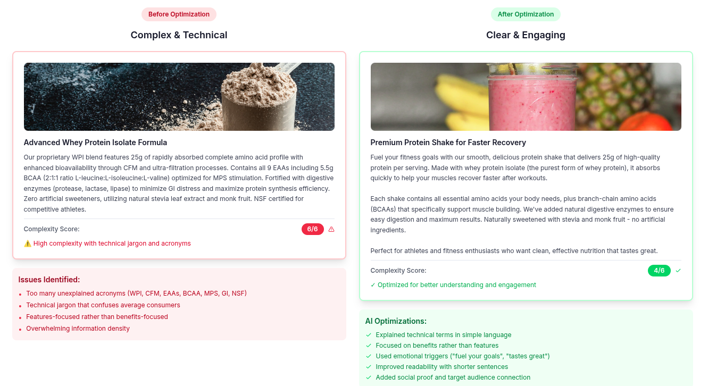

# FastAPI Gemini Integration

This project extract a complex ecommerce product item title and description from an API (simulated, internally it just load a JSON file) and using Gemini AI Free tier model Gemini 2.5 Flash will transform them into engaging, persuasive messaging.

Example:



- ✅ FastAPI with async support
- ✅ Poetry for dependency management
- ✅ Type hints and MyPy support
- ✅ Code formatting with Black
- ✅ Linting with Ruff
- ✅ Testing with pytest
- ✅ Health check endpoint
- ✅ Environment variables support

## Prerequisites

- Python 3.12+
- Poetry 1.8+

## Installation

```bash
# Install Poetry (if not installed)
curl -sSL https://install.python-poetry.org | python3 -

# Clone repository
git clone <your-repo-url>
cd fastapi-gemini

# Install dependencies
poetry install

# Copy environment variables
cp .env.example .env
```

## Development

```bash
# Run development server
poetry run uvicorn app.main:app --reload --host 0.0.0.0 --port 8000

# Run tests
poetry run pytest

# Lint code
poetry run ruff check .

# Type checking
poetry run mypy .
```

## Endpoints

- `GET /` - gemini message
- `GET /health` - Health check endpoint
- `GET /api/docs` - Swagger UI documentation
- `GET /api/redoc` - ReDoc documentation

## Production Deployment

```bash
# Build the project
poetry build

# Run with Uvicorn (production settings)
poetry run uvicorn app.main:app --host 0.0.0.0 --port 8000 --workers 4
```

## Docker (Optional)

```dockerfile
FROM python:3.11-slim

WORKDIR /app

RUN pip install poetry==1.8.3

COPY pyproject.toml poetry.lock* ./
RUN poetry config virtualenvs.create false && poetry install --no-dev --no-interaction --no-ansi

COPY ./app ./app

CMD ["uvicorn", "app.main:app", "--host", "0.0.0.0", "--port", "8000"]
```

## Project Structure

```
.
├── app/
│   └── main.py           # FastAPI application
├── tests/                # Test files (create as needed)
├── .env.example          # Environment variables template
├── .gitignore            # Git ignore rules
├── pyproject.toml        # Poetry configuration
└── README.md             # This file
```

## Next Steps

1. Update CORS origins in production
2. Add authentication/authorization
3. Implement logging
4. Add database integration (SQLAlchemy/Tortoise-ORM)
5. Set up CI/CD pipeline
6. Add monitoring and observability
7. Implement rate limiting
8. Add caching layer (Redis)

## License

MIT
